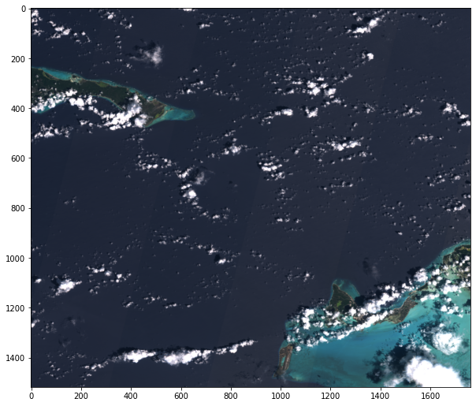

## Satellite Imagery Downloader

A simple satellite imagery downloader script for Google Earth Engine. Works for Sentinel-1 and Sentinel-2. The approach highlighted can be applied to any image dataset on GEE.

